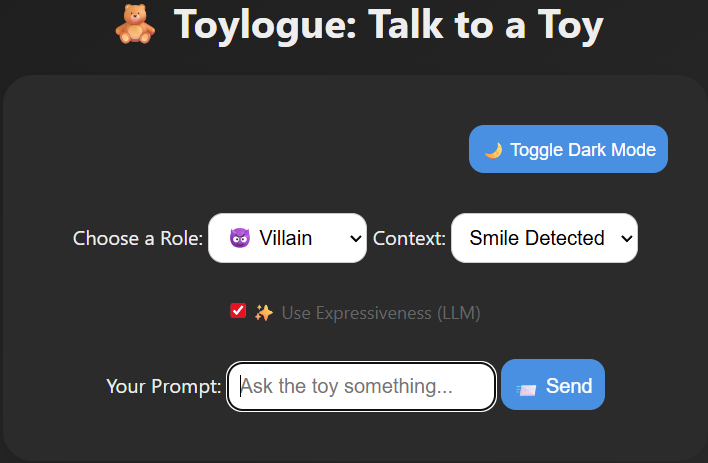

<<<<<<< HEAD
<!-- Improved compatibility of back to top link: See: https://github.com/othneildrew/Best-README-Template/pull/73 -->
<a id="readme-top"></a>

[![Contributors][contributors-shield]][contributors-url]
[![Forks][forks-shield]][forks-url]
[![Stargazers][stars-shield]][stars-url]
[![Issues][issues-shield]][issues-url]
[![MIT License][license-shield]][license-url]
[![LinkedIn][linkedin-shield]][linkedin-url]

<br />
<div align="center">
  <a href="https://github.com/brasondo/toylogue-grammar-engine">
    
  </a>

<h3 align="center">Toylogue</h3>

  <p align="center">
    A modular, constraint-driven grammar engine for expressive toy dialogue.
    <br />
    <a href="https://github.com/brasondo/toylogue-grammar-engine"><strong>Explore the docs »</strong></a>
    <br />
    <br />
    <a href="https://github.com/brasondo/toylogue-grammar-engine">View Demo</a>
    ·
    <a href="https://github.com/brasondo/toylogue-grammar-engine/issues/new?labels=bug&template=bug-report---.md">Report Bug</a>
    ·
    <a href="https://github.com/brasondo/toylogue-grammar-engine/issues/new?labels=enhancement&template=feature-request---.md">Request Feature</a>
  </p>
</div>

<details>
  <summary>Table of Contents</summary>
  <ol>
    <li>
      <a href="#about-the-project">About The Project</a>
      <ul>
        <li><a href="#built-with">Built With</a></li>
      </ul>
    </li>
    <li>
      <a href="#getting-started">Getting Started</a>
      <ul>
        <li><a href="#prerequisites">Prerequisites</a></li>
        <li><a href="#installation">Installation</a></li>
      </ul>
    </li>
    <li><a href="#usage">Usage</a></li>
    <li><a href="#live-app-interface">Live App Interface</a></li>
    <li><a href="#roadmap">Roadmap</a></li>
    <li><a href="#contributing">Contributing</a></li>
    <li><a href="#license">License</a></li>
    <li><a href="#contact">Contact</a></li>
    <li><a href="#acknowledgments">Acknowledgments</a></li>
  </ol>
</details>

## About The Project

[![Toylogue][product-screenshot]](https://github.com/brasondo/toylogue-grammar-engine)

Toylogue is a modular, grammar-driven NLP engine for generating expressive, role-specific dialogue for toys, characters, and games.  
It combines structured grammar (YAML) with syntactic introspection (spaCy), logical role constraints (Prolog), CFG modeling (NLTK), and optional LLM surface realization (e.g. Ollama).  
Designed to demonstrate linguistic engineering skills for narrative design, Toylogue outputs contextualized, emotionally resonant dialogue grounded in generative syntax.

<p align="right">(<a href="#readme-top">back to top</a>)</p>

### Built With

* Python 3.12+
* YAML (grammar definition)
* JSON (grammar export)
* spaCy (syntactic analysis)
* NLTK (generative grammar modeling)
* Prolog (role-tone logic validation)
* Visual Studio Code
* Git
* Optional: Ollama or OpenAI (LLM surface realization)

<p align="right">(<a href="#readme-top">back to top</a>)</p>

## Getting Started

To get a local copy up and running:

### Prerequisites

* Python 3.10+  
* pip (Python package manager)  
* [SWI-Prolog](https://www.swi-prolog.org/) (required for logic validation)  
* [Ollama](https://ollama.com/) (optional, for LLM-based enhancement)

> Python dependencies such as `pyyaml`, `spacy`, `nltk`, and `pyswip` are installed via `requirements.txt`.

### Installation

```bash
git clone https://github.com/brasondo/toylogue-grammar-engine.git
cd toylogue-grammar-engine
python -m venv venv
# On Windows:
venv\Scripts\activate
# On macOS/Linux:
source venv/bin/activate
pip install -r requirements.txt
python -m spacy download en_core_web_sm
```

### Run the Grammar Demo
```
python demo.py
```

Launch the Web App
```
python app.py
# Then open http://localhost:3000 in your browser
```


<p align="right">(<a href="#readme-top">back to top</a>)</p>


<!-- USAGE EXAMPLES -->
## Usage

The grammar engine loads rules from `phrases.yaml`, recursively generates symbolic phrases, and can optionally enhance them using an LLM for expressive surface realization.

### Role-Based Example with LLM Realization

```python
structure = recursive_generate(rules, symbol="S_VILLAIN")
print("Raw:", structure)

refined = surface_realize_with_ollama(structure, role="villain")
print("Ollama:", refined)
```
> Note: This example uses Ollama (`llama3`) running locally. You must install and start Ollama separately. You may modify to use openai.ChatCompletion instead.

<p align="right">(<a href="#readme-top">back to top</a>)</p>


Sample Output:
Raw: Hello — I'm Voidmaster and ruler of all you see.  
Ollama: (cackling) "Yes! I am VOIDMASTER, ruler of all you see and destroyer of hope!"

## Live App Interface

Toylogue also includes a browser-based interface where users can:

- Select toy character roles (e.g., Hero, Villain, Goofball)
- Prompt the toy with questions or context
- Hear role-specific expressive responses aloud
- See animated toy images per role
- Toggle dark mode and continue branching conversation threads

To launch the app locally:

```bash
python app.py
# Then visit http://localhost:3000
```

<p align="right">(<a href="#readme-top">back to top</a>)</p>


<!-- ROADMAP -->
## Roadmap

- [x] Modular grammar engine using YAML rules
- [x] Role- and tone-aware dialogue construction
- [x] Recursive grammar expansion via `S -> NP VP`-style rules
- [x] Prolog logic for tone-role constraint validation
- [x] NLTK CFG tree generation (generative syntax demo)
- [x] spaCy POS + dependency introspection
- [x] LLM-based expressive surface realization via Ollama
- [x] Interactive web interface with dark mode and animated typing
- [x] Character avatars and voice synthesis per role (SpeechSynthesis API)
- [x] Follow-up prompt support for branching dialogue
- [ ] Persistent toy personality memory across turns
- [ ] Context-sensitive response planning (mood, setting, tone shift)
- [ ] Grammar authoring UI for non-technical users
- [ ] Exportable toy dialogue profiles for integration into real games

See the [open issues](https://github.com/brasondo/toylogue-grammar-engine/issues) for a full list of proposed features (and known issues).

<p align="right">(<a href="#readme-top">back to top</a>)</p>


<!-- CONTRIBUTING -->
## Contributing

Contributions are what make the open source community such an amazing place to learn, inspire, and create. Any contributions you make are **greatly appreciated**.

If you have a suggestion that would make this better, please fork the repo and create a pull request. You can also simply open an issue with the tag "enhancement".
Don't forget to give the project a star! Thanks again!

1. Fork the Project
2. Create your Feature Branch (`git checkout -b feature/AmazingFeature`)
3. Commit your Changes (`git commit -m 'Add some AmazingFeature'`)
4. Push to the Branch (`git push origin feature/AmazingFeature`)
5. Open a Pull Request

<p align="right">(<a href="#readme-top">back to top</a>)</p>

### Top contributors:

<a href="https://github.com/brasondo/toylogue-grammar-engine/graphs/contributors">
  
</a>


<!-- LICENSE -->
## License

Distributed under the MIT License. See `LICENSE.txt` for more information.

<p align="right">(<a href="#readme-top">back to top</a>)</p>


<!-- CONTACT -->
## Contact

Brason Dobson - braleee@outlook.com 
🔗 [LinkedIn](https://linkedin.com/in/brasondo)


Project Link: [https://github.com/brasondo/toylogue-grammar-engine](https://github.com/brasondo/toylogue-grammar-engine)

<p align="right">(<a href="#readme-top">back to top</a>)</p>


<!-- ACKNOWLEDGMENTS -->
## Acknowledgments

* [Machler Labs](http://www.machlerlabs.com) — for inspiring this project’s focus on modular, expressive language systems for toys


<p align="right">(<a href="#readme-top">back to top</a>)</p>


<!-- MARKDOWN LINKS & IMAGES -->
<!-- https://www.markdownguide.org/basic-syntax/#reference-style-links -->
[contributors-shield]: https://img.shields.io/github/contributors/brasondo/toylogue-grammar-engine.svg?style=for-the-badge
[contributors-url]: https://github.com/brasondo/toylogue-grammar-engine/graphs/contributors
[forks-shield]: https://img.shields.io/github/forks/brasondo/toylogue-grammar-engine.svg?style=for-the-badge
[forks-url]: https://github.com/brasondo/toylogue-grammar-engine/network/members
[stars-shield]: https://img.shields.io/github/stars/brasondo/toylogue-grammar-engine.svg?style=for-the-badge
[stars-url]: https://github.com/brasondo/toylogue-grammar-engine/stargazers
[issues-shield]: https://img.shields.io/github/issues/brasondo/toylogue-grammar-engine.svg?style=for-the-badge
[issues-url]: https://github.com/brasondo/toylogue-grammar-engine/issues
[license-shield]: https://img.shields.io/github/license/brasondo/toylogue-grammar-engine.svg?style=for-the-badge
[license-url]: https://github.com/brasondo/toylogue-grammar-engine/blob/master/LICENSE.txt
[linkedin-shield]: https://img.shields.io/badge/-LinkedIn-black.svg?style=for-the-badge&logo=linkedin&colorB=555
[linkedin-url]: https://linkedin.com/in/brasondo
[product-screenshot]: images/product-screenshot.png
=======
# Python Flask ReplAuth

Using the ReplAuth with Flask is super easy! First we create a new Flask app: 

<details>
  <summary>Import Flask and create new Flask app</summary>

```python
from flask import Flask, render_template, request
app = Flask('app')
@app.route('/')
```
</details>

And then we request the headers: 

<details>
  <summary>Requested Headers:</summary>

```python
def hello_world():
    print(request.headers)
    return render_template(
        'index.html',
        user_id=request.headers['X-Replit-User-Id'],
        user_name=request.headers['X-Replit-User-Name'],
        user_roles=request.headers['X-Replit-User-Roles'],
        user_bio=request.headers['X-Replit-User-Bio'],
        user_profile_image=request.headers['X-Replit-User-Profile-Image'],
        user_teams=request.headers['X-Replit-User-Teams'],
        user_url=request.headers['X-Replit-User-Url']
    )
```
</details>

In this code we've requested all the possible headers, which are these:

<details>
  <summary>All Replit Headers</summary>

```python
X-Replit-User-Bio
X-Replit-User-Id
X-Replit-User-Name
X-Replit-User-Profile-Image
X-Replit-User-Roles
X-Replit-User-Teams
X-Replit-User-Url
```
</details>

Once we've requested all these headers, we can show the information we've got after the user has passed through the Auth. This info will be displayed on the console, but can also be displayed in a html file.

We can show this by displaying the variable assigned to a header in a HTML tag (it can also be shown without a tag). If we wanted to show the username of the user we would put this:

```html
<h1>{{ user_name }}</h1>
```

And the output will be a heading (h1) with the username. 

# ReplAuth FAQ 

The question is in a quote and in italic and the answer is in a bullet point.

<details>
  <summary>ReplAuth FAQ</summary>
  
  > *How many ReplAuths are there?*
  
  - There are 2 repl auths!
 ---
  > *Which ReplAuths are there?*
  
  - Node.js and Python Flask
---
  > *Is there a Replit Documentation on ReplAuths?*

  - Yes! You can find it in the [Replit Docs](https://docs.replit.com)
</details>

# Template

**Name**: Python Flask ReplAuth

**Description**: Python Flask ReplAuth is easy and useful to use! What are you waiting for? Start using ReplAuth today!

# Questions?

If you have any question please look at our support resources:

- [Replit Docs](https://docs.replit.com)
- [Ask forum](https://ask.replit.com)
>>>>>>> d8ea818 (Initial commit)
